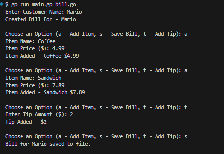

# Bill Generator

This is a simple command-line application written in Go that allows you to generate a bill for a customer, add items to the bill, update the tip, and save the bill to a text file.

## Structure

The project is structured as follows:

- `main.go`: This is the entry point of the application. It contains the main function and functions for user interaction.
- `bill.go`: This file defines the `Bill` struct and its methods for managing the bill.
- `bills/`: This directory contains the saved bills as text files.

## Usage

1. Run the application using the command `go run main.go bill.go`. You will be prompted to enter a customer name.
2. You will then be presented with a menu of options:
   - `a`: Add an item to the bill. You will need to enter the item name and price.
   - `t`: Add a tip to the bill. You will need to enter the tip amount.
   - `s`: Save the bill to a text file in the `bills/` directory.
3. You can continue to add items and tips as needed. When you're done, choose the `s` option to save the bill.

## Example

Here is an example of a saved bill for a customer named Mario:

